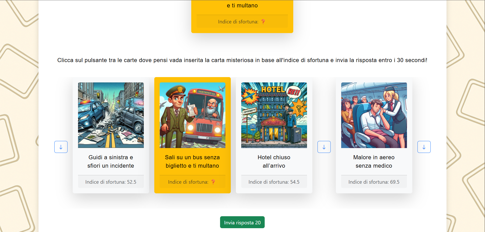
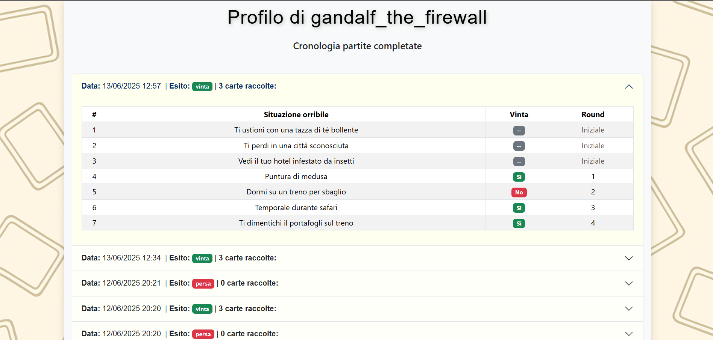

# 🌍 Stuff Happens: Travel & Tourism Edition


> **Exam Project for "Web Applications I"** > A React-based web game inspired by *Timeline*, where players must rank travel mishaps based on their "Bad Luck Index."

## 📖 About the Project

This application allows users to play a card game focused on travel misfortunes (e.g., "Flight cancelled," "Lost luggage"). The goal is to place a new card into the correct position within a growing timeline of events, ordered by their severity (unluckiness index).

The project demonstrates a full-stack implementation using **React** for the frontend and **Node.js/Express** for the backend, featuring authentication, session management, and complex game state logic.

## 🚀 Tech Stack

* **Frontend:** React, React Router, CSS Modules/Bootstrap
* **Backend:** Node.js, Express.js
* **Database:** SQLite (managed via DAO pattern)
* **Authentication:** Passport.js (Local Strategy)

---

## 📸 Screenshots

| Game Interface | Round Result |
|:---:|:---:|
|  |  |

---

## 🛠 Installation & Setup

1.  **Clone the repository:**
    ```bash
    git clone [https://github.com/your-username/your-repo-name.git](https://github.com/your-username/your-repo-name.git)
    cd your-repo-name
    ```

2.  **Install Server Dependencies:**
    ```bash
    cd server
    npm install
    ```

3.  **Install Client Dependencies:**
    ```bash
    cd ../client
    npm install
    ```

4.  **Run the Application:**
    * Start the server: `node index.js` (or `nodemon index.js`) inside the `/server` folder.
    * Start the client: `npm start` inside the `/client` folder.
    * The app will be available at `http://localhost:3000`.

---

## 🧪 Test Credentials

You can use the following pre-registered accounts to test the application:

| Username | Password | Notes |
| :--- | :--- | :--- |
| `gandalf_the_firewall` | `youshallnotpass!` | User with match history |
| `tu_sai_chi` | `avada123kedavra` | User with match history |
| `TizioQualunque` | `password123abc` | New user (no history) |

---

## 🧱 Architecture & Design

### React Client Routes

* `/`: **Home Page**. Public access. Displays game rules, links to Demo and Login.
* `/demo`: **Demo Page**. Public access. A single-round game for anonymous users.
* `/demo/risultato`: **Demo Result**. Public access. Shows the outcome of the demo.
* `/login`: **Login Page**. Public access.
* `/profilo`: **Profile Page**. Protected. Shows user stats and game history.
* `/partita`: **Game Page**. Protected. The main game interface.
* `/partita/round/risultato`: **Round Result**. Protected. Feedback on the specific round.
* `/partita/risultato`: **Game Result**. Protected. Final summary of the match.
* `*`: **Not Found**. Handles 404 errors.

### Database Schema

The data is structured using the following tables:

* **`carte`**: Contains all game cards (`id`, `nome`, `immagine`, `indice`). Cards are stored unordered to prevent ID-based guessing.
* **`utenti`**: Registered users (`id`, `username`, `password`, `salt`).
* **`partite`**: Stores match states (`id`, `utente_id`, `stato`, `rounds_giocati`, `data`). The "unfinished" state prevents users from rejoining completed games or exploiting concurrency.
* **`partita_rounds`**: Tracks individual rounds (`id`, `partita_id`, `carta_id`, `tempo_inizio`, `stato`). Includes timestamps for server-side security checks.
* **`partita_carte`**: Maps cards to specific matches (`id`, `partita_id`, `carta_id`, `vinta_in_round`). Includes the initial hand (round 0).

---

## 📡 API Documentation

### Authentication & Sessions

#### **Create Session (Login)**
* **URL:** `/api/sessioni`
* **Method:** `POST`
* **Body:**
    ```json
    { "username": "tu_sai_chi", "password": "avada123kedavra" }
    ```
* **Response:** `201 Created` (Success), `401 Unauthorized` (Invalid credentials).

#### **Get Current Session**
* **URL:** `/api/sessioni/corrente`
* **Method:** `GET`
* **Response:** `200 OK` (User info), `401 Unauthorized` (Not logged in).

#### **Logout**
* **URL:** `/api/sessioni/corrente`
* **Method:** `DELETE`
* **Response:** `200 OK`.

### Game Logic

#### **Create New Game**
* **URL:** `/api/utenti/:uid/partite`
* **Method:** `POST`
* **Description:** Starts a new game for the user and deals the initial 3 cards.
* **Response:** `201 Created`
    ```json
    {
      "partita_id": 6,
      "mazzo": [
        { "id": 100, "nome": "...", "immagine": "50.png", "indice": 22 },
        ...
      ]
    }
    ```

#### **Start New Round**
* **URL:** `/api/partite/:pid/rounds`
* **Method:** `POST`
* **Description:** Generates a new round and provides the card to be guessed.
* **Response:** `201 Created`
    ```json
    {
      "round_id": 1,
      "carta": { "id": 83, "nome": "...", "immagine": "33.png" }
    }
    ```

#### **Submit Round Answer**
* **URL:** `/api/partite/:pid/rounds/:rid/risposta`
* **Method:** `PUT`
* **Body:** `{ "posizione": "1" }`
* **Response:** `200 OK`
    ```json
    {
      "msg": "Risposta corretta, hai vinto il round",
      "stato": "vinto",
      "partita": "in corso"
    }
    ```

#### **Get Current Hand**
* **URL:** `/api/partite/:pid/mazzo`
* **Method:** `GET`
* **Description:** Returns the user's collected cards sorted by misfortune index.

#### **Get Game Stats**
* **URL:** `/api/partite/:pid/stats`
* **Method:** `GET`
* **Response:** `{ "vittorie": 0, "sconfitte": 1 }`

#### **Get User Game History**
* **URL:** `/api/utenti/:uid/partite`
* **Method:** `GET`
* **Description:** Returns a detailed list of past games, including specific rounds and cards.

### Demo Mode

#### **Get Demo Game**
* **URL:** `/api/demo/partita`
* **Method:** `GET`
* **Description:** Returns 3 initial cards + 1 card to guess for the demo.

#### **Submit Demo Answer**
* **URL:** `/api/demo/risposta`
* **Method:** `PUT`
* **Body:** Includes the answer position and the current state of the demo deck.
* **Response:** `200 OK` (Win/Loss status).

---

## 📂 Main Components Overview

* **`HomePage`**: Entry point. Handles routing to Demo or Login.
* **`DemoPage` / `DemoResult`**: Manages the simplified game flow for anonymous users, including a 30-second timer.
* **`GamePage`**: The core game loop. Displays the user's hand (scrollable), the current card to guess, and manages the timer.
* **`RoundResult` / `GameResult`**: Feedback components displaying messages based on the outcome (Win/Loss/Timeout).
* **`ProfilePage` / `GameHistory`**: Displays the user's dashboard and an accordion-style history of past matches.
* **`GameCards`**: A reusable component for rendering cards in various sizes and contexts.

---

## 🎓 Academic Disclaimer
This project was developed by **Lorenzo Bosso** (s349410) as the final exam for the *Web Applications I* course at **Politecnico di Torino** (Master's Degree in Computer Engineering).

*Current students refer to the university's academic integrity policy regarding plagiarism.*